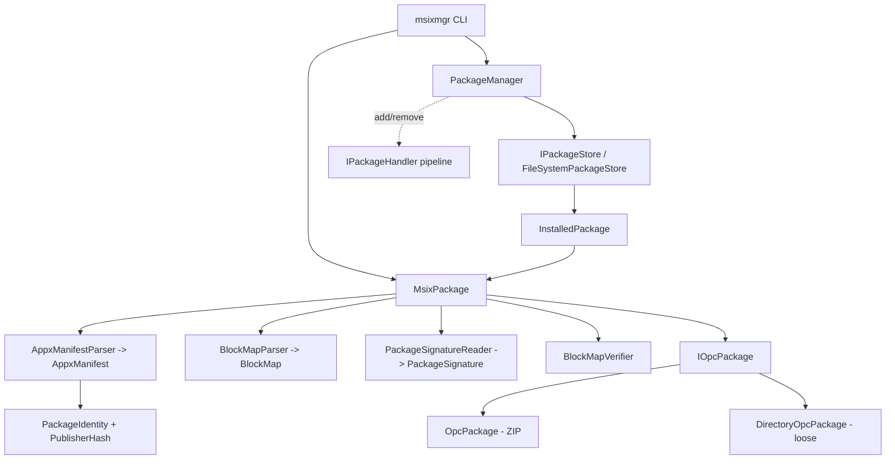

# Architecture

MSIX Core (.NET) is organized as a strict, bottom-up stack. Each layer depends
only on the layers below it and exposes a small, testable surface. The two
libraries — `MsixCore.Packaging` (reading + integrity) and `MsixCore.Deployment`
(store + lifecycle) — sit under the `msixmgr` CLI.

## Layering

```
┌──────────────────────────────────────────────────────────────────┐
│  msixmgr CLI            Program → InspectCommand / ValidateCommand │
│                         PackageOpener, Reports (text + --json)     │
├──────────────────────────────────────────────────────────────────┤
│  Deployment engine      PackageManager : IPackageManager          │
│  (MsixCore.Deployment)  IMsixResponse / InstallationStep          │
│                         IPackageHandler pipeline (add/remove)      │
├──────────────────────────────────────────────────────────────────┤
│  Package store / query  IPackageStore → FileSystemPackageStore    │
│  (MsixCore.Deployment)  InstalledPackage : IInstalledPackage      │
│                         Wildcard (glob matching)                  │
├──────────────────────────────────────────────────────────────────┤
│  Integrity              BlockMapParser / BlockMapVerifier         │
│  (MsixCore.Packaging)   PackageSignatureReader → PackageSignature │
├──────────────────────────────────────────────────────────────────┤
│  Manifest / identity    AppxManifestParser → AppxManifest         │
│  (MsixCore.Packaging)   BundleManifestParser, PackageIdentity,    │
│                         PublisherHash (family/full name)          │
├──────────────────────────────────────────────────────────────────┤
│  OPC container          IOpcPackage                               │
│  (MsixCore.Packaging)   OpcPackage (ZIP) / DirectoryOpcPackage    │
│                         OpcPartNames                              │
└──────────────────────────────────────────────────────────────────┘
```



`MsixPackage` is the façade that stitches the reader layers together: it owns an
`IOpcPackage`, lazily parses the manifest and block map, and exposes
`VerifyBlockMap()` and `ReadSignature()`.

## Layer 1 — OPC container (`MsixCore.Packaging.Opc`)

Every MSIX/APPX package (and bundle) is an Open Packaging Conventions ZIP
container. `IOpcPackage` is the low-level, format-agnostic reader:

- **`OpcPackage`** — backed by `System.IO.Compression.ZipArchive`. It indexes
  entries by part name (case-insensitive), rejecting invalid or duplicate part
  names up front. Read-only and **not** thread-safe (callers must synchronize).
- **`DirectoryOpcPackage`** — backed by a filesystem directory holding an
  unpacked ("loose") layout. Part names are the root-relative file paths with
  forward slashes. This is what makes loose inspection/validation/registration
  possible cross-platform.
- **`OpcPartNames`** — well-known part-name constants (`AppxManifest.xml`,
  `AppxBlockMap.xml`, `AppxSignature.p7x`, `AppxMetadata/AppxBundleManifest.xml`,
  `[Content_Types].xml`).

Both implementations share `OpcPackage.IsValidPartName` and
`OpcPackage.NormalizeLookup`, so container and loose layouts enforce identical
part-name rules.

## Layer 2 — Manifest & identity (`MsixCore.Packaging.Manifest`)

- **`AppxManifestParser`** parses `AppxManifest.xml` into an immutable
  `AppxManifest` record (identity, display/publisher names, capabilities,
  applications, target device families). Parsing is **namespace-tolerant**
  (elements matched by local name) so a single implementation spans MSIX schema
  revisions.
- **`BundleManifestParser` / `BundleManifest`** cover `.msixbundle`/`.appxbundle`
  metadata (contained application/resource packages and their qualifiers).
- **`PackageIdentity`** models the `<Identity>` element and computes the derived
  `PackageFamilyName` (`{Name}_{publisherHash}`) and `PackageFullName`
  (`{Name}_{Version}_{Architecture}_{ResourceId}_{publisherHash}`).
- **`PublisherHash`** implements the Windows publisher-hash algorithm:
  SHA-256 of the UTF-16LE publisher DN → first 8 bytes → 13-character MSIX Base32
  (`0123456789abcdefghjkmnpqrstvwxyz`). E.g. the Microsoft Store publisher hashes
  to `8wekyb3d8bbwe`.
- **`ManifestVersion`** enforces the MSIX four-part version quad (four
  components, each `0..65535`), which is stricter than `System.Version`.

## Layer 3 — Integrity (`MsixCore.Packaging.Integrity`)

- **`BlockMapParser` / `BlockMap`** parse `AppxBlockMap.xml` — per-file blocks
  (64 KiB each), base64 block hashes, and hash method (SHA-256/384/512). File
  names are normalized from the block map's native backslashes to forward
  slashes to match OPC part names.
- **`BlockMapVerifier`** re-hashes every block-mapped file's **uncompressed**
  content and checks per-block hashes, total size, and block count, then runs a
  **coverage** check: every payload part must be in the block map and vice-versa
  (excluding `AppxBlockMap.xml`, `AppxSignature.p7x`, and `[Content_Types].xml`).
  It is pure managed code, so it gates packages on Linux CI.
- **`PackageSignatureReader` / `PackageSignature`** read `AppxSignature.p7x`
  (stripping the `PKCX` magic), decode the PKCS#7/CMS envelope with `SignedCms`
  (OpenSSL-backed on Linux), and extract the primary signer (subject/issuer DN,
  thumbprint, validity) plus a CMS-envelope integrity flag.
  `PackageSignature.MatchesPublisher` compares canonicalized X.500 DNs.

> **Integrity ≠ authenticity.** `PackageSignature.IsCmsIntegrityValid` asserts
> only that the CMS envelope is internally consistent. The tool does **not** yet
> verify the APPX indirect-data digest binding (that the signature is bound to
> *this* package's block map/manifest) nor the certificate trust chain. The
> `validate` verb states this explicitly.

## Layer 4 — Package store & query (`MsixCore.Deployment`)

- **`IPackageStore`** abstracts where installed packages are recorded and where
  their unpacked payloads live. **`FileSystemPackageStore`** is a self-contained,
  cross-platform store: each installed package is a subdirectory (identified by
  the presence of `AppxManifest.xml`) under a store root, defaulting to
  `LocalApplicationData/MsixCore/Packages`.
- **`InstalledPackage`** wraps a loose `MsixPackage` and adds
  `InstalledLocation` and resolved `ExecutionInfo` (the primary app's executable
  path, safely resolved within the install root).
- **`Wildcard`** implements case-insensitive, whole-string glob matching (`*` and
  `?`) used by `FindPackages`, with a regex timeout guard.

## Layer 5 — Deployment engine (`MsixCore.Deployment`)

- **`PackageManager : IPackageManager`** implements the query surface today
  (`FindPackage`, `FindPackageByFamilyName`, `FindPackages`,
  `GetMsixPackageInfo`) over an `IPackageStore`, with careful ownership/disposal
  of enumerated packages. `AddPackage`/`RemovePackage` return
  `IMsixResponse` and currently throw `NotImplementedException` (later phase).
- **`IMsixResponse` / `MsixResponse`** model an async operation: a `Completion`
  task, `Percentage`/`Status` (`InstallationStep`), a `ProgressChanged` event,
  and `Cancel()`. (Interface present; `MsixResponse` concrete type lands with the
  engine.)
- **`IPackageHandler` / `PackageDeploymentContext`** define the add/remove
  pipeline: handlers run in order on add and in reverse on remove, each guarded
  by `IsApplicable` so OS-integration steps (shortcuts, registry, associations)
  only run on their platform. Extraction is the cross-platform handler.
- **`DeploymentOptions`** is a `[Flags]` enum (`None`, `ForceApplicationShutdown`,
  `ExtractOnly`).

## Layer 6 — CLI (`msixmgr`)

`Program.Main` dispatches verbs. `PackageOpener` transparently opens a `.msix`
file **or** a loose directory (`MsixPackage.Open` vs `MsixPackage.OpenDirectory`),
so every verb supports both layouts. `InspectCommand` and `ValidateCommand`
build `record` reports (`InspectionReport`, `ValidationReport`) rendered as text
or indented JSON (`--json`). See [cli.md](cli.md).

## Cross-platform design decisions

- **No Windows-only dependencies in the reader/integrity path.** OPC is
  `ZipArchive`, XML is `System.Xml.Linq` with a hardened reader, hashing is
  `System.Security.Cryptography`, and signatures use `SignedCms` (OpenSSL on
  Linux). This is what lets `validate` run in Linux CI.
- **Loose layouts are first-class.** `DirectoryOpcPackage` mirrors `OpcPackage`
  so inspection, validation, and the deployment store all work on unpacked
  directories without a container.
- **Idiomatic .NET shapes.** Native `HRESULT`/pointer interfaces become
  properties, exceptions, records, and `Task`-based async. Enum numeric values
  (`ProcessorArchitecture`) intentionally match the Windows
  `APPX_PACKAGE_ARCHITECTURE` values for faithful interop/telemetry.
- **OS integration is opt-in and guarded.** Anything platform-specific lives
  behind `IPackageHandler.IsApplicable`, keeping the libraries buildable and
  testable everywhere.

## Security invariants

- **OPC part-name canonicalization.** `OpcPackage.IsValidPartName` rejects empty,
  rooted, backslash-containing names and any `.`/`..`/empty segment; lookups are
  normalized (`NormalizeLookup`) and stored names are canonical forward-slash
  form. Duplicate (case-insensitively equal) part names are rejected, per OPC.
- **Zip-slip / path-traversal defenses.** Traversal segments are rejected at the
  part-name layer. `DirectoryOpcPackage` additionally requires each resolved file
  path to stay within the package root (`Path.GetFullPath(...).StartsWith(root)`)
  and **skips symlinks/reparse points** so a crafted loose layout cannot escape
  the root. `InstalledPackage.ResolveExecutionInfo` similarly rejects rooted or
  `..`-escaping executable paths from the (untrusted) manifest.
- **XML hardening.** All parsers (`AppxManifestParser`, `BundleManifestParser`,
  `BlockMapParser`) create readers with `DtdProcessing.Prohibit` and no external
  `XmlResolver`, blocking XXE and entity-expansion attacks.
- **Block-map integrity gating.** `BlockMapVerifier` hashes uncompressed content
  and enforces two-way coverage between payload and block map, so extra,
  missing, or tampered files fail verification. `validate` surfaces this as a
  non-zero exit code.
- **Explicit signature scope.** CMS-envelope integrity is reported but never
  conflated with authenticity; binding and trust-chain checks are explicitly
  marked unverified until implemented.
