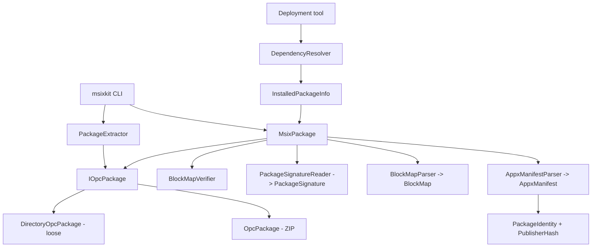

# Architecture

MSIX Core (.NET) is organized as a strict, bottom-up stack. Each layer depends
only on the layers below it and exposes a small, testable surface. The two
libraries — `MsixCore.Packaging` (reading, authoring + integrity) and
`MsixCore.PackageStore` (extraction + dependency resolution) — sit under the
`msixkit` CLI.

## Layering

```
┌──────────────────────────────────────────────────────────────────┐
│  msixkit CLI            Program → InspectCommand / ValidateCommand │
│                         PackageOpener, Reports (text + --json)     │
├──────────────────────────────────────────────────────────────────┤
│  Tooling                PackageExtractor (unpack)                 │
│  (MsixCore.PackageStore)  DependencyResolver (deployability)       │
│                         InstalledPackageInfo (installed metadata) │
├──────────────────────────────────────────────────────────────────┤
│  Integrity              BlockMapParser / BlockMapVerifier         │
│  (MsixCore.Packaging)   PackageSignatureReader → PackageSignature │
├──────────────────────────────────────────────────────────────────┤
│  Manifest / identity    AppxManifestParser → AppxManifest         │
│  (MsixCore.Packaging)   BundleManifestParser, PackageIdentity,    │
│                         PublisherHash (family/full name)          │
├──────────────────────────────────────────────────────────────────┤
│  OPC container          IOpcPackage                               │
│  (MsixCore.Packaging)   OpcPackage (ZIP) / DirectoryOpcPackage    │
│                         OpcPartNames                              │
└──────────────────────────────────────────────────────────────────┘
```



`MsixPackage` is the façade that stitches the reader layers together: it owns an
`IOpcPackage`, lazily parses the manifest and block map, and exposes
`VerifyBlockMap()` and `ReadSignature()`.

## Layer 1 — OPC container (`MsixCore.Packaging.Opc`)

Every MSIX/APPX package (and bundle) is an Open Packaging Conventions ZIP
container. `IOpcPackage` is the low-level, format-agnostic reader:

- **`OpcPackage`** — backed by `System.IO.Compression.ZipArchive`. It indexes
  entries by part name (case-insensitive), rejecting invalid or duplicate part
  names up front. Read-only and **not** thread-safe (callers must synchronize).
- **`DirectoryOpcPackage`** — backed by a filesystem directory holding an
  unpacked ("loose") layout. Part names are the root-relative file paths with
  forward slashes. This is what makes loose inspection/validation/registration
  possible cross-platform.
- **`OpcPartNames`** — well-known part-name constants (`AppxManifest.xml`,
  `AppxBlockMap.xml`, `AppxSignature.p7x`, `AppxMetadata/AppxBundleManifest.xml`,
  `[Content_Types].xml`).

Both implementations share `OpcPackage.IsValidPartName` and
`OpcPackage.NormalizeLookup`, so container and loose layouts enforce identical
part-name rules.

## Layer 2 — Manifest & identity (`MsixCore.Packaging.Manifest`)

- **`AppxManifestParser`** parses `AppxManifest.xml` into an immutable
  `AppxManifest` record (identity, display/publisher names, capabilities,
  applications, target device families). Parsing is **namespace-tolerant**
  (elements matched by local name) so a single implementation spans MSIX schema
  revisions.
- **`BundleManifestParser` / `BundleManifest`** cover `.msixbundle`/`.appxbundle`
  metadata (contained application/resource packages and their qualifiers).
- **`PackageIdentity`** models the `<Identity>` element and computes the derived
  `PackageFamilyName` (`{Name}_{publisherHash}`) and `PackageFullName`
  (`{Name}_{Version}_{Architecture}_{ResourceId}_{publisherHash}`).
- **`PublisherHash`** implements the Windows publisher-hash algorithm:
  SHA-256 of the UTF-16LE publisher DN → first 8 bytes → 13-character MSIX Base32
  (`0123456789abcdefghjkmnpqrstvwxyz`). E.g. the Microsoft Store publisher hashes
  to `8wekyb3d8bbwe`.
- **`ManifestVersion`** enforces the MSIX four-part version quad (four
  components, each `0..65535`), which is stricter than `System.Version`.

## Layer 3 — Integrity (`MsixCore.Packaging.Integrity`)

- **`BlockMapParser` / `BlockMap`** parse `AppxBlockMap.xml` — per-file blocks
  (64 KiB each), base64 block hashes, and hash method (SHA-256/384/512). File
  names are normalized from the block map's native backslashes to forward
  slashes to match OPC part names.
- **`BlockMapVerifier`** re-hashes every block-mapped file's **uncompressed**
  content and checks per-block hashes, total size, and block count, then runs a
  **coverage** check: every payload part must be in the block map and vice-versa
  (excluding `AppxBlockMap.xml`, `AppxSignature.p7x`, and `[Content_Types].xml`).
  It is pure managed code, so it gates packages on Linux CI.
- **`PackageSignatureReader` / `PackageSignature`** read `AppxSignature.p7x`
  (stripping the `PKCX` magic), decode the PKCS#7/CMS envelope with `SignedCms`
  (OpenSSL-backed on Linux), and extract the primary signer (subject/issuer DN,
  thumbprint, validity, and the subject's raw DER bytes) plus a CMS-envelope
  integrity flag. `PackageSignature.MatchesPublisher` compares the manifest
  `Publisher` against the signer subject **by decoded RDN sequence**: it decodes
  the signer DN from the certificate's original raw subject bytes
  (`SubjectNameRawData`) — preserving exact RDN order and attribute encoding —
  then compares each RDN's OID and decoded string value. Comparing decoded values
  makes matching independent of the ASN.1 string encoding
  (`PrintableString` vs `UTF8String`); multi-valued RDNs fall back to a raw-bytes
  comparison. This replaces the earlier whole-DN raw-byte compare, which produced
  false mismatches on encoding or ordering differences.

> **Integrity ≠ authenticity.** `PackageSignature.IsCmsIntegrityValid` asserts
> only that the CMS envelope is internally consistent. The tool does **not**
> verify the APPX indirect-data digest binding (that the signature is bound to
> *this* package's block map/manifest) and intentionally delegates certificate
> trust-chain and revocation evaluation to the platform/signing environment. The
> `validate` verb states this explicitly.

## Layer 4 — Tooling (`MsixCore.PackageStore`)

- **`PackageExtractor`** (public, static) extracts an `IOpcPackage`'s parts to a
  directory as a loose layout. Pure managed and cross-platform, it powers the
  `unpack` CLI verb. It reports progress (0–100), honors cancellation between
  chunks, and enforces the traversal defenses described under
  [Security invariants](#security-invariants).
- **`InstalledPackageInfo`** reads only `AppxManifest.xml` from an installed
  layout, owning no file handles, and opens a loose `MsixPackage` only when
  payload content such as the logo is requested.
- **`DependencyResolver`** answers whether a package's declared `Dependencies`
  are satisfied by a given set of installed packages. It is a pure function: the
  caller supplies the installed set, so the same decision logic serves a Windows
  deployment tool reading the OS package inventory, a CI job reading a directory
  of staged packages, and a test.

### Why there is no install engine

Earlier revisions carried a full deployment engine here — `PackageManager`, a
transactional `FileSystemPackageStore` with a crash-recovery journal,
`IMsixResponse` progress plumbing, and a planned `IPackageHandler` pipeline.
That existed because the original MSIX Core installed packages on Windows 7/8,
where the OS could not.

That is no longer this project's purpose. Windows 10 and 11 install MSIX
natively, so a second, non-OS-integrated store had no consumer: it registered
nothing with the OS, so nothing it "installed" could actually be launched.
Shipping it would have meant supporting a public API surface with no scenario
behind it, and carrying the attack surface of transactional filesystem code
nobody depended on.

It was removed — about 3,700 lines including tests. What survives is what a real
deployment tool needs and cannot easily rewrite correctly: extraction with
traversal defenses, and dependency resolution. `DependencyResolver` was
decoupled from the store as part of that removal, which is why it now takes an
`IEnumerable<InstalledPackageInfo>` rather than an `IPackageStore`.

## Authoring (`MsixCore.Packaging.Authoring`)

`MsixPackageBuilder` authors deterministic packages; `MsixBundleBuilder` authors
deterministic `.msixbundle`/`.appxbundle` containers from existing child packages.
Both share `StoredZipWriter`, `BlockMapWriter`, and OPC content-type generation.

The bundle layout was derived differentially from Windows SDK
`makeappx.exe` 10.0.26100.8249:

- child packages are ZIP **Stored** entries and are not listed in the bundle block map;
- each manifest `Package/@Offset` is the absolute byte offset of the child's payload
  (immediately after its local file header), while `Size` is the uncompressed child
  package byte length;
- `AppxBlockMap.xml` maps only
  `AppxMetadata\AppxBundleManifest.xml`; the bundle manifest, block map, and content
  types are block-DEFLATE entries;
- schema 5.0 uses the 2013 bundle namespace, `b4`/`b5` ignorable namespaces,
  application `Architecture`, resource `ResourceId`, resource qualifiers, and
  `b4:Dependencies` copied from each child manifest;
- `[Content_Types].xml` maps `.msix`/`.appx` to
  `application/vnd.ms-appx`, XML to
  `application/vnd.ms-appx.bundlemanifest+xml`, and overrides the block map type.

MakeAppx writes data descriptors after Stored child entries, while this writer puts
CRC/sizes directly in deterministic local headers. The resulting payload offsets
differ by those descriptor bytes but have the same meaning; MakeAppx successfully
unbundles the authored container and reproduces every child byte-for-byte.

## Layer 6 — CLI (`msixkit`)

`Program.Main` dispatches verbs. `PackageOpener` transparently opens a `.msix`
file **or** a loose directory (`MsixPackage.Open` vs `MsixPackage.OpenDirectory`),
so every verb supports both layouts. `InspectCommand`, `ValidateCommand`, and
`UnpackCommand` build `record` reports (`InspectionReport`, `ValidationReport`,
`UnpackReport`) rendered as text or indented JSON (`--json`). `unpack` drives
`PackageExtractor` directly. See [cli.md](cli.md).

## Cross-platform design decisions

- **No Windows-only dependencies in the reader/integrity path.** OPC is
  `ZipArchive`, XML is `System.Xml.Linq` with a hardened reader, hashing is
  `System.Security.Cryptography`, and signatures use `SignedCms` (OpenSSL on
  Linux). This is what lets `validate` run in Linux CI.
- **Loose layouts are first-class.** `DirectoryOpcPackage` mirrors `OpcPackage`
  so inspection and validation work on unpacked directories without a container,
  and `PackageExtractor` produces such layouts cross-platform (powering `unpack`).
- **Idiomatic .NET shapes.** Native `HRESULT`/pointer interfaces become
  properties, exceptions, records, and `Task`-based async. Enum numeric values
  (`ProcessorArchitecture`) intentionally match the Windows
  `APPX_PACKAGE_ARCHITECTURE` values for faithful interop/telemetry.
- **No platform-specific code.** Everything here builds and runs identically on
  Windows, Linux, and macOS. OS integration is the job of the deployment tool
  consuming these libraries, not of the libraries themselves.

## Security invariants

- **OPC part-name canonicalization.** `OpcPackage.IsValidPartName` rejects empty,
  rooted, backslash-containing names and any `.`/`..`/empty segment; lookups are
  normalized (`NormalizeLookup`) and stored names are canonical forward-slash
  form. Duplicate (case-insensitively equal) part names are rejected, per OPC.
- **Zip-slip / path-traversal defenses.** Traversal segments are rejected at the
  part-name layer. `DirectoryOpcPackage` additionally requires each resolved file
  path to stay within the package root (`Path.GetFullPath(...).StartsWith(root)`)
  and **skips symlinks/reparse points** so a crafted loose layout cannot escape
  the root. `PackageExtractor` applies the same containment on the way *out*:
  each part must resolve under the destination, and it refuses to extract when a
  symlink/junction appears anywhere on the destination path — including the
  destination root itself or a **dangling** link (detected via no-follow
  `LinkTarget`, not `Exists`, so a broken link can't slip through and redirect a
  write). `InstalledPackageInfo` similarly refuses to treat a directory or
  reparse point named `AppxManifest.xml` as a manifest.
- **XML hardening.** All parsers (`AppxManifestParser`, `BundleManifestParser`,
  `BlockMapParser`) create readers with `DtdProcessing.Prohibit` and no external
  `XmlResolver`, blocking XXE and entity-expansion attacks.
- **Block-map integrity gating.** `BlockMapVerifier` hashes uncompressed content
  and enforces two-way coverage between payload and block map, so extra,
  missing, or tampered files fail verification. `validate` surfaces this as a
  non-zero exit code.
- **Explicit signature scope.** CMS-envelope integrity is reported but never
  conflated with authenticity; binding is unverified, and trust-chain checks are
  delegated to the platform/signing environment. Publisher matching
  (`PackageSignature.MatchesPublisher`) compares the manifest `Publisher` to the
  signer subject by **decoded RDN sequence** from the certificate's raw subject
  bytes, so it is faithful to RDN order and attribute encoding rather than
  sensitive to a lossy re-encoding.
